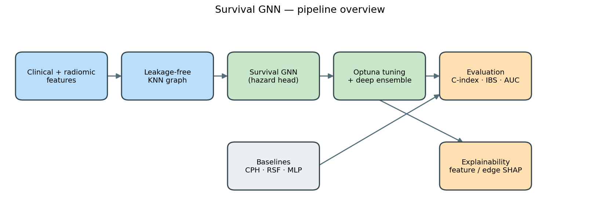
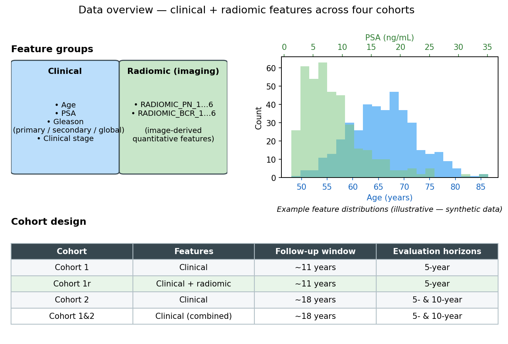
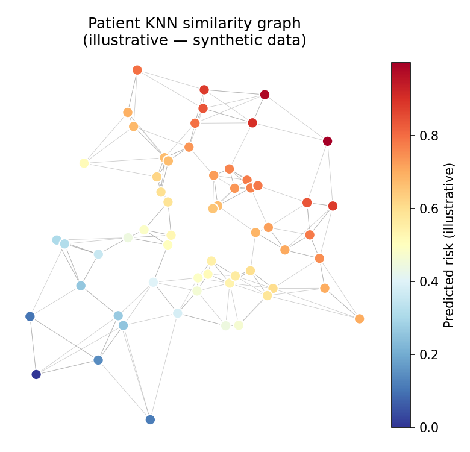
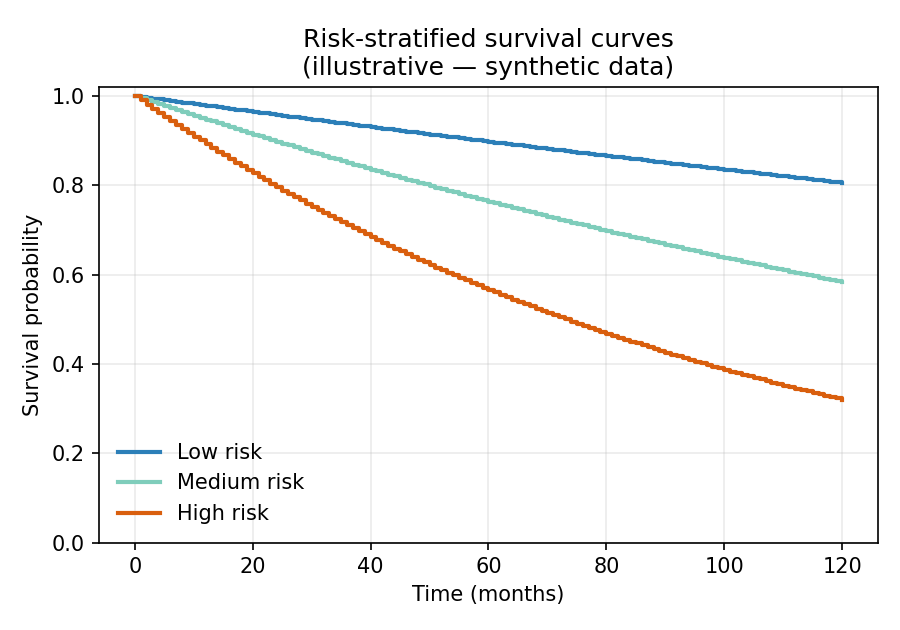
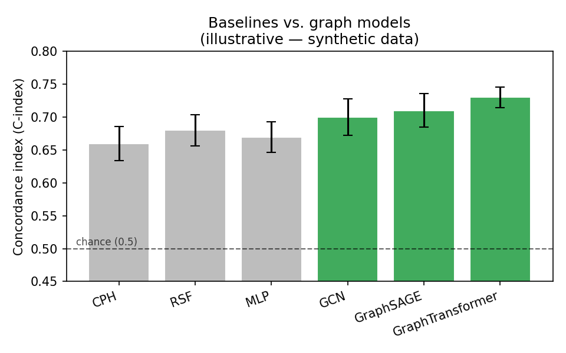

# Survival GNN — Graph Neural Networks for Time-to-Event Survival Analysis

> ⚠️ **Work in progress.** This repository is under active development and accompanies
> a research project whose paper is currently **in preparation**. Code, structure, and
> documentation may change. Results shown here are *illustrative figures on synthetic
> data* — see [Data availability](#data-availability).

A research codebase that applies **Graph Neural Networks (GNNs)** to **time-to-event
(survival) modelling** of cancer patients. Patients are connected into a **leakage-free
K-nearest-neighbour (KNN) similarity graph**, and a GNN with a **discrete-time hazard
head** predicts individual survival curves. The pipeline includes hyperparameter
optimization (Optuna), deep ensembles, classical survival baselines, and graph-based
explainability.

---

## Highlights

- **Graph construction** — patients as nodes, KNN edges built from clinical features
  (cosine / euclidean), with strict train/test separation to avoid information leakage.
- **Discrete-time survival GNN** — a node-level model with a hazard head trained with a
  negative-log-likelihood survival loss; outputs full per-patient survival curves.
- **Multiple GNN backbones** — GCN, GIN, GraphSAGE, GraphTransformer, and Graphormer,
  selected through a common model registry.
- **Classical baselines** — Cox Proportional Hazards (CPH), Random Survival Forest (RSF),
  and an MLP, all tuned with the same Optuna protocol as the GNNs for a fair comparison.
- **Hyperparameter optimization** — Optuna search with nested cross-validation.
- **Deep ensembles** — multi-seed ensembling with horizon-based threshold tuning.
- **Evaluation** — concordance index (C-index), integrated Brier score (IBS-IPCW),
  time-dependent AUC, and balanced accuracy at clinical horizons.
- **Explainability** — feature- and edge-level SHAP (including Monte-Carlo SHAP) and
  patient ego-graph visualizations.
- **HPC-ready** — every configuration can be launched together as SLURM array jobs on the
  [Digital Research Alliance of Canada](https://alliancecan.ca/) clusters.

---

## Pipeline overview



Patients are encoded as nodes in a leakage-free KNN similarity graph; a survival GNN with
a discrete-time hazard head is tuned with Optuna and deep-ensembled, then evaluated
against classical baselines (CPH / RSF / MLP) and interpreted with feature- and edge-level
SHAP.

---

## Data

The models use a combination of **clinical** features (age, PSA, Gleason scores, clinical
stage) and **radiomic** (imaging-derived quantitative) features. Experiments span **four
cohorts** that differ in feature composition and follow-up length:

| Cohort | Features | Follow-up | Horizons |
|--------|----------|-----------|----------|
| Cohort 1 | Clinical | ~11 years | 5-year |
| Cohort 1r | Clinical + radiomic | ~11 years | 5-year |
| Cohort 2 | Clinical | ~18 years | 5- & 10-year |
| Cohort 1&2 | Clinical (combined) | ~18 years | 5- & 10-year |



> The figure is a **schematic with synthetic distributions** — it shows the feature
> groups and cohort design, not real patient statistics. See
> [Data availability](#data-availability).

---

## Illustrative output

> All figures below are generated from **synthetic random data** by
> [`make_readme_figures.py`](make_readme_figures.py). They illustrate the *kind* of output
> the pipeline produces and do **not** contain real patient data or real results.

| Patient similarity graph | Risk-stratified survival | Model comparison |
|---|---|---|
|  |  |  |

Regenerate them with:

```bash
python make_readme_figures.py   # writes to assets/
```

---

## Repository structure

```
survival-gnn/
│
├── survival/                  Survival pipeline (primary)
│   ├── data_loader.py             Load survival data; build leakage-free KNN graphs
│   ├── objective.py               Optuna objective for survival GNNs
│   ├── optimize.py                Run Optuna hyperparameter search
│   ├── test.py                    Evaluate the best model on held-out test folds
│   ├── train_ensemble.py          Deep ensemble across seeds + threshold tuning
│   ├── evaluate.py                Standalone evaluation utilities
│   ├── interpret_example.py       Survival-aware SHAP / MC-SHAP explainability
│   └── baseline_cph_rsf.py        Classical CPH / RSF baselines
│
├── classification/            Binary-classification pipeline (secondary)
│   └── ...                         Direct event prediction (no time component)
│
├── models/                    GNN backbones + survival head
│   ├── survival_node.py           SurvivalNodeGNN (discrete-time hazard head)
│   ├── gcn.py · gin.py · graphsage.py · graph_transformer.py · graphormer.py
│   └── __init__.py                MODEL_REGISTRY (name -> class)
│
├── losses/survival_loss.py    Discrete-time survival loss (NLL-based)
├── metrics/survival_metrics.py  C-index, IBS-IPCW, time-dependent AUC, Brier score
├── utils/                     Config loading, device/seed helpers, calibration
│
├── configs/                   YAML experiment configs (one per outcome × graph setting)
│
├── explain.py                 SHAP node + edge explainers (used by interpret_example)
├── cleanup_*.py               Housekeeping utilities for checkpoints / Optuna logs
└── make_readme_figures.py     Synthetic illustrative figures for this README
```

---

## Survival outcomes modelled

| Outcome | Label | Time | Description |
|---------|-------|------|-------------|
| Biochemical recurrence | `BCR` | `BCR_TIME` | Time to BCR |
| Overall death | `DEATH` | `DEATH_TIME` | Overall survival |
| Castration-resistant cancer | `CRPC` | `CRPC_TIME` | Time to CRPC |
| Hormonal therapy | `HTX` | `HTX_TIME` | Time to hormonal therapy |
| Metastasis | `METASTASIS` | `METASTASIS_TIME` | Time to metastasis |

Configs follow the naming pattern
`{outcome}_config_{graph_method}_{graph_feature}_{cohort}.yaml`
(e.g. `bcr_config_cos_GG_c1.yaml`).

---

## Installation

```bash
git clone https://github.com/<your-username>/survival-gnn.git
cd survival-gnn
python -m venv .venv && source .venv/bin/activate
pip install -r requirements.txt
```

`torch-geometric` may require matching `torch-scatter` / `torch-sparse` wheels for your
CUDA/CPU build — follow the
[official PyG installation guide](https://pytorch-geometric.readthedocs.io/en/latest/install/installation.html).

---

## Usage

The pipeline is config-driven. A typical single-experiment flow:

```bash
# 1. Hyperparameter search for one config
python -m survival.optimize --config configs/bcr_config_cos_GG_c1.yaml

# 2. Evaluate the best model on held-out folds
python -m survival.test --config configs/bcr_config_cos_GG_c1.yaml

# 3. Build a deep ensemble
python -m survival.train_ensemble --config configs/bcr_config_cos_GG_c1.yaml

# 4. Classical baselines
python -m survival.baseline_cph_rsf --config configs/bcr_config_cos_GG_c1.yaml
```

### Running at scale (HPC)

The experiments were designed to run on the
[Digital Research Alliance of Canada](https://alliancecan.ca/) clusters. Every step is
parameterized by config, so **all configurations can be submitted together** as SLURM
array jobs (sweeping outcomes, graph methods, features, cohorts, and `k`), then collected
for evaluation. The SLURM submission scripts themselves are kept out of this public
repository as they contain cluster-specific account and path settings.

---

## Data availability

The clinical patient data used in this project are **private** and cannot be shared. This
repository contains **code only** — no patient data, no trained models, and no
experimental results. All figures in this README are produced from synthetic random data.
The code is published for transparency and to demonstrate the methodology.

---

## Status & roadmap

This project is **ongoing**. Planned / in-progress work includes additional graph
construction strategies, extended explainability, and external validation. Interfaces may
change until the associated paper is finalized.

---

## License

All rights reserved while the associated paper is in preparation — see [LICENSE](LICENSE).
A permissive open-source license is planned after publication.

## Author

**Zahra Khazaei** — Graph machine learning for clinical survival analysis.
Questions and collaboration inquiries are welcome.

- 📧 Email: [zahra1997khazaei@gmail.com](mailto:zahra1997khazaei@gmail.com)
- 💼 LinkedIn: [zahra-khazaei](https://www.linkedin.com/in/zahra-khazaei-b936771b9/)
- 🔬 ORCID: [0009-0002-6850-9930](https://orcid.org/0009-0002-6850-9930)
- 🎓 Google Scholar: [profile](https://scholar.google.com/citations?user=FfLT0fUAAAAJ&hl=en)
- 📄 ResearchGate: [Zahra-Khazaei](https://www.researchgate.net/profile/Zahra-Khazaei-9)
